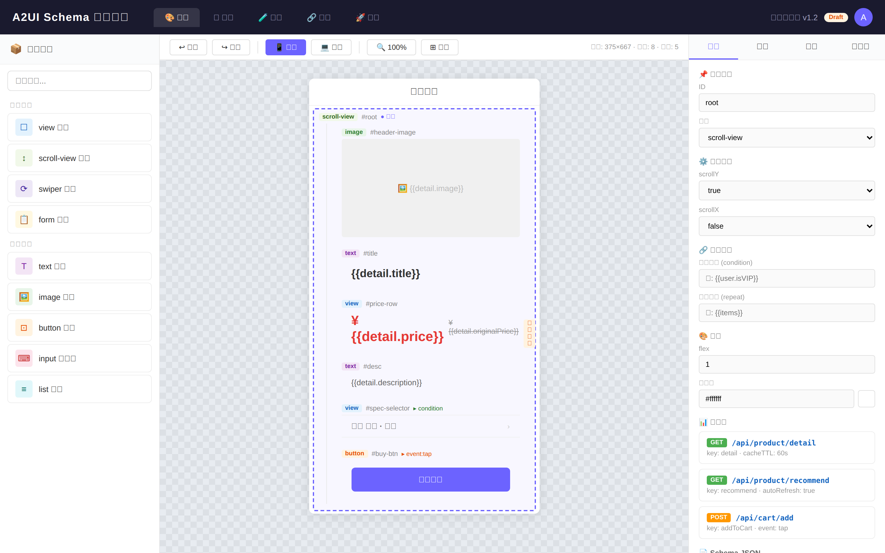
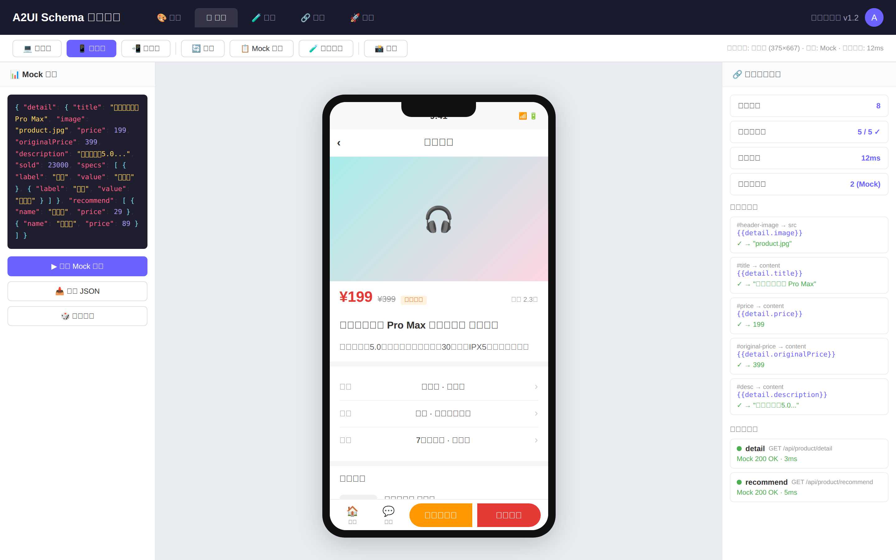
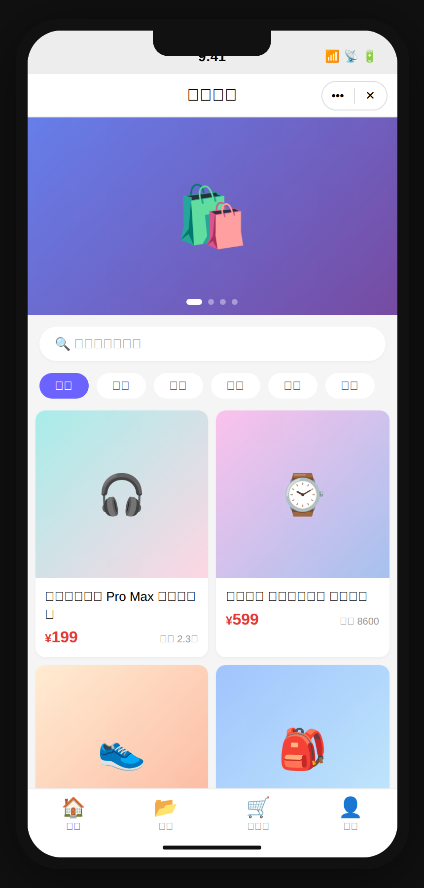
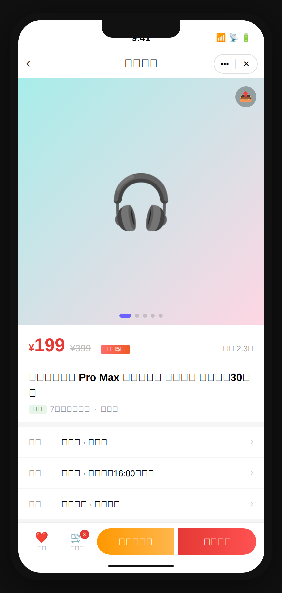

# A2UI Shell

Cross-platform Server-Driven UI (SDUI) rendering engine with a dual-channel fetching architecture.

## Architecture

A2UI Shell implements a **Dual-Channel Fetching** pattern:

```
┌─────────────────────────────────────────────────────┐
│                   A2UI Shell                        │
│                                                     │
│  ┌──────────────┐         ┌──────────────┐          │
│  │ Channel 1    │         │ Channel 2    │          │
│  │ SchemaLoader │         │ DataFetcher  │          │
│  │ (CDN/Redis)  │         │ (API)        │          │
│  └──────┬───────┘         └──────┬───────┘          │
│         │ SchemaDocument         │ DataContext       │
│         └──────────┬─────────────┘                  │
│                    ▼                                │
│           ┌────────────────┐                        │
│           │ BindingEngine  │                        │
│           │ Schema + Data  │                        │
│           └───────┬────────┘                        │
│                   │ RenderNode tree                 │
│                   ▼                                 │
│           ┌────────────────┐                        │
│           │   Renderer     │                        │
│           │ Component Tree │                        │
│           └────────────────┘                        │
└─────────────────────────────────────────────────────┘
```

### Core Modules

| Module | Role |
|--------|------|
| **SchemaLoader** | Channel 1 — Loads JSON schema from CDN with `?v={hash}` cache control |
| **DataFetcher** | Channel 2 — Assembles `ApiRequest` objects, executes them concurrently |
| **BindingEngine** | Merges schema + data, resolves `{{expressions}}`, conditional rendering, list repetition |
| **Renderer** | Converts the resolved render tree into a platform-neutral component output |
| **A2UIShell** | Orchestrator that ties all modules together |

## Quick Start

```typescript
import { A2UIShell } from './src';

const shell = new A2UIShell({
  schemaCdnBase: 'https://cdn.example.com',
  apiBase: 'https://api.example.com',
  cacheStrategy: 'memory',
  debug: true,
});

const result = await shell.loadAndRender({
  pageKey: 'home',
  version: 'v1-abc123',
  params: { userId: '42' },
});

console.log(result.output);   // Component render tree
console.log(result.timing);   // Performance metrics
```

## Schema Format

```json
{
  "version": "v1-abc123",
  "meta": {
    "title": "Home Page",
    "navigationBar": { "title": "Home" }
  },
  "root": {
    "id": "root",
    "type": "view",
    "props": {},
    "children": [
      {
        "id": "greeting",
        "type": "text",
        "props": { "content": "Hello, {{userInfo.name}}!" }
      },
      {
        "id": "itemList",
        "type": "view",
        "props": {},
        "repeat": "listData.items",
        "repeatItem": "item",
        "children": [
          {
            "id": "itemTitle",
            "type": "text",
            "props": { "content": "{{item.title}}" }
          }
        ]
      }
    ]
  },
  "dataSources": [
    { "key": "userInfo", "api": "/api/user/info", "method": "GET" },
    { "key": "listData", "api": "/api/list", "method": "GET", "cacheTTL": 60 }
  ]
}
```

## Features

- **Binding expressions**: `{{user.name}}`, `{{list[0].title}}`
- **Conditional rendering**: `"condition": "user.isVIP"`
- **List repetition**: `"repeat": "items"` with `repeatItem` / `repeatIndex`
- **Comparison operators**: `===`, `!==`, `>`, `<`, `>=`, `<=`
- **Schema caching**: Memory cache with version-hash cache busting
- **Data caching**: TTL-based response caching
- **Request deduplication**: Concurrent requests for the same schema are deduplicated
- **Concurrent data fetching**: All data sources load in parallel via `Promise.allSettled`
- **Lifecycle hooks**: `onSchemaLoaded`, `onDataLoaded`, `onRenderComplete`, `onError`
- **Custom components**: Extensible component registry with validation and prop transforms

## Schema Management Platform

The management platform provides a complete lifecycle for SchemaDocuments — from design and testing to publishing.

### Architecture

```
┌─────────────────────────────────────────────────────────────┐
│              Schema Management Platform                      │
│                                                              │
│  ┌──────────────┐  ┌───────────────┐  ┌──────────────────┐  │
│  │SchemaManager │  │SchemaDesigner │  │ PreviewEngine    │  │
│  │ CRUD + Status│  │ Templates     │  │ Desktop/Mobile/  │  │
│  │ Versioning   │  │ Node Builder  │  │ MiniProgram      │  │
│  └──────────────┘  │ Validation    │  └──────────────────┘  │
│                    └───────────────┘                         │
│  ┌──────────────┐  ┌───────────────┐  ┌──────────────────┐  │
│  │BindingTester │  │MockTestRunner │  │  OSSPublisher    │  │
│  │ Expression   │  │ Scenario-based│  │ Aliyun/Tencent/  │  │
│  │ Validation   │  │ Full pipeline │  │ AWS/Custom       │  │
│  └──────────────┘  └───────────────┘  └──────────────────┘  │
│                                                              │
│  ┌──────────────────────────────────────────────────────┐   │
│  │         UITestDiagramGenerator (SVG)                  │   │
│  │  管理平台设计 | 管理平台预览 | 小程序预览 | 小程序操作   │   │
│  └──────────────────────────────────────────────────────┘   │
└─────────────────────────────────────────────────────────────┘
```

### Modules

| Module | Role |
|--------|------|
| **SchemaManager** | CRUD operations, lifecycle status management (draft→testing→preview→published→archived), version tracking |
| **SchemaDesigner** | Template-based schema creation, node builder, tree manipulation, design-time validation |
| **SchemaPreviewEngine** | Preview schemas with mock/real data, desktop/mobile/miniprogram viewports, SVG snapshot generation |
| **BindingTester** | Test binding expressions, detect unresolved bindings, run assertions against expected results |
| **MockTestRunner** | Full-pipeline mock testing with scenarios, validate node counts and component types |
| **OSSPublisher** | Publish schemas to OSS (Aliyun/Tencent/AWS/custom), version management, CDN URL generation |
| **UITestDiagramGenerator** | Generate SVG test UI diagrams for management platform and mini-program interfaces |

### Usage

```typescript
import {
  SchemaManager,
  SchemaDesigner,
  BindingTester,
  MockTestRunner,
  OSSPublisher,
  UITestDiagramGenerator,
  SchemaPreviewEngine,
} from './src';

// 1. Design a schema
const designer = new SchemaDesigner();
const schema = designer.createFromTemplate('list-page')!;

// 2. Manage lifecycle
const manager = new SchemaManager();
manager.create('home-page', 'Home Page', schema, { author: 'dev', tags: ['page'] });
manager.setStatus('home-page', 'testing');

// 3. Test bindings
const tester = new BindingTester();
const bindingResult = tester.runTest(schema, {
  name: 'Binding validation',
  inputData: { items: [{ title: 'Item 1', description: 'Desc' }] },
});
console.log(bindingResult.passed); // true

// 4. Mock test
const mockRunner = new MockTestRunner();
const mockResult = mockRunner.runScenario(schema, {
  name: 'Happy path',
  mockDataSources: [{ key: 'items', data: [{ title: 'A', description: 'B' }] }],
});
console.log(mockResult.passed); // true

// 5. Preview
const preview = new SchemaPreviewEngine();
const snapshot = preview.preview(schema, { items: [{ title: 'A', description: 'B' }] });
console.log(snapshot.diagram); // SVG string

// 6. Publish to OSS
const publisher = new OSSPublisher({
  provider: 'aliyun',
  bucket: 'my-schemas',
  region: 'cn-hangzhou',
  basePath: '/a2ui',
  cdnBaseUrl: 'https://cdn.example.com/a2ui',
});
const publishResult = await publisher.publish('home-page', schema);
console.log(publishResult.url); // CDN URL

// 7. Generate test UI diagrams
const diagramGen = new UITestDiagramGenerator();
const diagrams = diagramGen.generateAll(schema);
// diagrams[0] => management-design (管理平台设计)
// diagrams[1] => management-preview (管理平台预览)
// diagrams[2] => miniprogram-preview (小程序预览)
// diagrams[3] => miniprogram-operation (小程序操作)
```

### Platform UI & Runtime Screenshots

The management platform includes 4 fully implemented HTML/CSS/JS pages in `platform/`, with runtime screenshots captured via Playwright in `docs/screenshots/`:

| Page | HTML Source | Screenshot | Description |
|------|-----------|------------|-------------|
| 管理平台 - 设计界面 | `platform/management-design.html` | `docs/screenshots/management-design.png` | Full designer UI with component palette, drag canvas, property panel, data source config |
| 管理平台 - 预览界面 | `platform/management-preview.html` | `docs/screenshots/management-preview.png` | Live preview with phone mockup, mock data editor, binding inspector |
| 小程序端 - 预览界面 | `platform/miniprogram-preview.html` | `docs/screenshots/miniprogram-preview.png` | WeChat mini-program home page with banner, search, categories, product grid, tab bar |
| 小程序端 - 操作界面 | `platform/miniprogram-operation.html` | `docs/screenshots/miniprogram-operation.png` | Product detail with price, specs, reviews, add-to-cart/buy actions |

#### 管理平台 - 设计界面


#### 管理平台 - 预览界面


#### 小程序端 - 预览界面


#### 小程序端 - 操作界面


### SVG Diagrams (Programmatic)

The `UITestDiagramGenerator` module also generates programmatic SVG diagrams from schema data. These are available in `docs/diagrams/` and can be regenerated from code.

## Development

```bash
npm install
npm run build         # Type check
npm test              # Run tests (177 tests across 12 test files)
npm run screenshots   # Capture runtime screenshots via Playwright
```